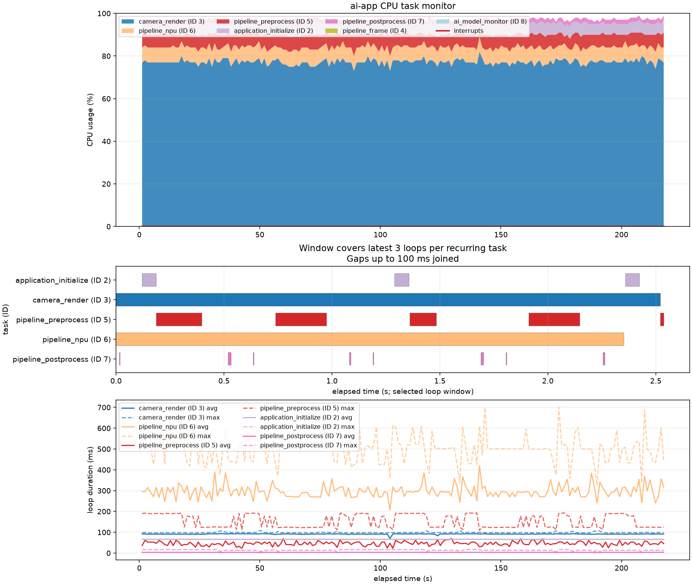
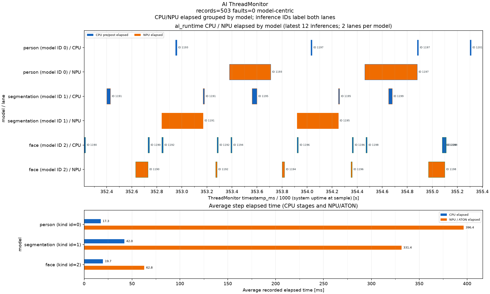

# μAI-Studio

μT-Kernel 3.0向けエッジAI開発環境

TRONプログラミングコンテスト2026 開発環境・開発ツール部門
後藤俊樹

[開発ガイド：μAI-Studio](https://kons-9.github.io/uai-studio/)

ハードウェアの前提とツールの取得から、カーネル、ドライバー、ミドルウェアの使い方まで、アプリ開発に必要な資料を公開しています。

<!-- 対象ボード: STM32N6570-DK / ライセンス: MIT（自作部分） -->

---

## μAI-Studioとは

μT-Kernel 3.0でNPUを使うAIアプリを開発するための開発環境

- 対象：STM32N6570-DK（Cortex-M55＋Neural-ART NPU）
- 画面設計、モデル変換、メモリ配置、ビルド、書き込み、解析までCLIで扱う。ホストツールは統合GUIからも使える
- TRON×AIを2つの面で実現する
  - **μT-Kernel上で動くAI**：NPU推論アプリを作るためのツールとミドルウェア
  - **AIが開発に参加できる開発環境**：AIエージェントがビルドから実機確認まで進められる

---

## 構成：開発ツール

| 構成要素 | 役割 |
|---|---|
| CMake・Make | ビルド、書き込み、UART監視 |
| UI Designer | 画面・操作の設計とPNG・C++生成 |
| auto_static_memory_layout | メモリ配置の生成・検査とGUI編集 |
| Feature Constraints（実験用） | 機能の共存条件を検証し、C++を生成 |
| AI model monitor / CPU task monitor | 実行記録の解析と可視化 |

統合GUIと独立CLIは共通処理。機能制約は実機の排他検証を含まない。

---

## 構成：実行基盤とサンプル

| 構成要素 | 役割 |
|---|---|
| ai_runtime、memory_manager、image_resizer、foundation | μT-Kernel上でのAI実行と、タスク・バッファの共通部品 |
| ui | UI Designerで生成した画面の描画とタッチ操作 |
| μT-KernelのフックAPI | タスク切替と割込みの記録 |
| ai-app | カメラ表示＋タッチ操作＋3モデル推論による機能評価 |

---

## 従来の開発との違い：開発環境

| | ベンダーIDE中心の開発 | μAI-Studio |
|---|---|---|
| 操作 | IDEのGUI | Makeのコマンド＋ホストツールのGUI |
| エディタ | IDEに固定 | 任意（LSP対応） |
| AIエージェント | GUI操作は任せにくい | ビルドから実機確認まで任せられる |

---

## 従来の開発との違い：AI実行

| | ベンダーIDE中心の開発 | μAI-Studio |
|---|---|---|
| メモリ配置 | 手で設定 | 生成して、ビルド時に検査 |
| NPUとCPUの並列化 | アプリごとに実装 | μT-Kernelのタスクで並列実行 |
| 性能の解析 | 個別に計測コードを書く | タスク別・モデル別に可視化 |

---

## 必要なもの

| | 内容 |
|---|---|
| ボード | STM32N6570-DK（カメラモジュールとLCDは付属）。USB Type-C 1本で電源、SWD、UART |
| ホスト | ネイティブLinux。CMake、GNU Armツールチェーン、Python 3.10以上、uv、minicom |
| STの無償ツール | STM32CubeMX 6.x、STM32CubeN6、STEdgeAI Core 4.0、STM32CubeProgrammer |

- ツールのパスとボードのシリアル番号は`build-system/host-config/local.mk`の1ファイルに設定するだけ
- 手順は開発ガイドの[はじめに](https://kons-9.github.io/uai-studio/getting-started/)、利用している既存ソフトウェアは`THIRD_PARTY_NOTICES.md`

---

## 開発の流れ

```sh
make -C userspace/ai-app setup
make -C userspace/ai-app monitor   # 別端末でUARTを開く
make -C userspace/ai-app ai-load   # 初回・モデル変更時
make -C userspace/ai-app ram-run
make -C userspace/ai-app thread-monitor
make -C userspace/ai-app cpu-task-monitor
```

**作る → 動かす → 測る → 直す**をコマンドだけで回せる

設計・解析の統合GUI：`uv run --project host_app python -m host_app`

---

## 課題1：開発環境がIDEとGUIに縛られる

- マイコン開発は、ベンダーIDEとGUI操作を前提にしたものが多い
- ビルド、書き込み、ログ確認がIDEの中に閉じていて、自動化しにくい
- AIコーディングエージェントやCIから同じ手順を再現しにくい
- 使い慣れたエディタやツールを選べない

---

## 解決1：CMakeとMakeで開発フローをコマンド化

- μT-Kernel 3.0本体、ドライバ、ミドルウェア、アプリをCMakeで一括ビルド
- `compile_commands.json`を出力し、clangdなどLSPに対応したエディタでコード補完が効く
- ホストごとの設定は`build-system/host-config/local.mk`の1ファイルに集約
- **AIエージェントも参加できる**：AGENTS.mdの手順に従い、ビルドからUARTでの起動確認まで進められる
- 完了条件は実機の起動ログ`camera: pipe1=started pipe2=started`で確認する

---

## 自分のアプリを追加する

カーネルを変更せずにアプリを追加できる

1. `userspace/<app>/src/main.cpp`に`usermain()`を書く
2. `CMakeLists.txt`でμT-Kernelとボード設定のターゲットをリンクする
3. `Makefile`でアプリ名を指定し、共通の`common.mk`を読み込む
4. CubeMXの設定ファイル（IOC）を`config/`に置く
5. `make -C userspace/<app> setup`、`ram-run`で動かす

最小例：`userspace/experiment-hello-world`（詳細は開発ガイドの[アプリの追加](https://kons-9.github.io/uai-studio/kernel/new-app/)）。`setup`、`ram-run`、`monitor`は共通。AI向け機能を使うには、ルートのCMakeとメモリ配置も設定する。

---

## 課題2：NPUアプリのメモリ配置は手作業

| 対象 | 置き場所 |
|---|---|
| モデルの重み | 外部NOR Flash |
| NPUコマンド | 外部NOR Flash（リンカで配置） |
| NPU作業領域 | NPU RAM |
| カメラ・表示・推論のフレーム | PSRAM |
| アプリ本体、実行記録 | 内部RAM / PSRAM |

- モデルの追加時に、アドレスとサイズの手動調整が必要
- 設定がずれると、**実機で原因の分かりにくい不具合**になる

---

## 解決2：メモリ配置の生成と検査（auto_static_memory_layout）

```text
board_memory.json ──────┐
application_memory.json ┼─▶ resolve ─▶ memory_layout.json ─┬─▶ C++ヘッダー
model_layout.json ──────┤              （配置の正本）       ├─▶ リンカスクリプト
STEdgeAIの生成物 ───────┘                                   └─▶ YAML（確認用）
```

- ボード定義、バッファ要求、STEdgeAIの生成物を読み込み、配置を決める
- C++ヘッダーとリンカスクリプトを生成し、CMakeのビルドに直接渡す
- 領域の重なり、容量不足、NPUコマンドの枠あふれを**ビルド時に検出**

GUIでもバッファ・予約領域を編集し、同じ処理で検証。入力と生成物をZIPで出力できる。

---

## 課題3：NPU推論とRTOSをどう組み合わせるか

- NPUの完了を待つ間、CPUを遊ばせたくない
- 推論が遅れても、カメラ映像の表示は止めたくない
- 複数のモデルを同時に扱いたい

---

## 解決3：μT-Kernel向けAIミドルウェア

**Pipe1：** カメラ → LCD表示（推論を待たない）<br>
**Pipe2：** カメラ → DCMIPP縮小 → 前処理 → NPU → 後処理

- **並列実行**：NPU推論中に、CPUは別モデルの前処理や後処理を進める
- **バッファ管理**：カメラDMA・LCD・推論の所有権を固定プールで管理する
- **タスク間通信**：フレームと推論結果を型付きの固定長メッセージで渡し、表示は最新の結果だけを使う
- **画像縮小**：DCMIPPでletterboxを行い、CPUの処理を減らす
- **排他制御**：ハードウェアの書き込み権を1つに限り、タスク間の競合を防ぐ

ミドルウェアはハードウェアとμT-Kernelを境界で切り離しており、ホストPCのGoogleTestでテストできる

---

## 課題4：どこで時間を使っているか見えない

- CPU、NPU、複数のタスクが並行して動くと、ボトルネックが分からない
- μT-Kernel 3.0には、タスク切替と割込みのフックAPI（`td_hok_dsp` / `td_hok_int`）が宣言されている
- しかし**実装がなく**、BSP2ではアプリから使えなかった

---

## 解決4：フックを実装し、CPUとNPUを可視化

- `td_hok_dsp` / `td_hok_int`を実装し、BSP2から登録できるようにした
- Cortex-M55のタスク切替・割込み処理からフックを呼び出す
- 標準APIなので、ほかのアプリも`UAI_KERNEL_TRACE_HOOKS`で利用可能（ai-appでは既定で有効）
- 記録はPSRAMに蓄積。ホストがSWDで一時停止して読み出すため、UARTの帯域を使わない
- 次の2つのモニターでCPUとNPUを可視化する。CLIでも統合GUIでも解析・表示できる

---

## 可視化の例：CPU task monitor

**上段** タスク別CPU使用率　**中段** タスクの実行状況　**下段** ループ時間

[](host_app/cpu_task_monitor/sample/cpu_task_monitor.png)

[元画像を開く（拡大表示）](host_app/cpu_task_monitor/sample/cpu_task_monitor.png)

---

## 可視化の例：AI model monitor

**上段** モデルごとのCPU（青）・NPU（橙）処理　**下段** 各段階の平均時間

[](host_app/ai_model_monitor/sample/ai_model_monitor.png)

[元画像を開く（拡大表示）](host_app/ai_model_monitor/sample/ai_model_monitor.png)

---

## 活用例1：CPUとNPUは並列に動いているか

評価用サンプル（3モデル同時推論）を実機で記録した結果

- personやsegmentationをNPUが推論している間に、faceの前処理や後処理がCPUで進んでいることを、AI model monitorのタイムラインで確認できた
- CPU task monitorからは、カメラ表示タスクがCPU時間の約77%を使っていることも分かる

---

## 活用例2：どこが遅いか

| モデル | CPU処理（平均） | NPU処理（平均） |
|---|---:|---:|
| person | 17.3 ms | 396.4 ms |
| segmentation | 42.0 ms | 331.4 ms |
| face | 19.7 ms | 62.8 ms（中央値20 ms、ときどき200 ms超） |

※記録の分解能は10 ms

- personとsegmentationのNPU処理が突出して長く、ここがボトルネックだと一目で分かる

<!-- TODO（任意）: 実施した対策と、改善前後の数値 -->

---

## 課題5：μT-Kernel向けのUI設計ツールがない

- 推論モデルや表示設定を、LCDのタッチ画面から操作したい
- 設計ツールがないため、部品の座標・色・画面遷移をC++で手書きする
- 配置を変えるたびにビルドと実機確認が必要で、試行錯誤に時間がかかる
- 画面外や部品の重なり、操作の割り当て漏れに気づきにくい

**画面を見ながら設計し、μT-Kernel上で使える形に変換したい。**

---

## 解決5：UI Designerで画面を設計し、C++を生成

```text
ブラウザ / CLI → ui_layout.json → PNGプレビュー / C++ → 実機のUI
```

- ブラウザで部品を配置し、複数画面・色・画面遷移・操作先を設定する
- 画面外や重なり、不正な遷移先を検証し、実機相当のPNGで確認する
- C++の画面定義とイベント配送を生成。操作先の実装漏れはコンパイルで検出

GUIでもCLIでも同じ処理を使い、`ui-layout-check`で設計と生成物の一致を確認する。

---

## 評価用サンプル：ai-app

- カメラ映像をLCDに表示しながら、3つのモデルをNPUで推論する
  - 人物検出（YOLOX nano）
  - 顔検出（BlazeFace）
  - セグメンテーション（DeepLab v3）
- UI Designerで画面を生成し、タッチでモデル選択、信頼度、表示設定を変更できる
- メモリ配置の生成、AI・UIミドルウェア、モニターを組み合わせている

<!-- TODO: デモ動画、写真 -->

---

## μT-Kernel 3.0との関わり

- μT-Kernel 3.0本体からアプリまでを、1つのCMakeプロジェクトでビルドする
- 宣言のみだったフックAPIを実装し、解析ツールの土台にした。μT-Kernel/DSの標準APIなので、ほかのアプリからも使える
- 推論の各段階を、μT-Kernelのタスクとして実行する
- カメラ、LCD、タッチ、NPU、NOR Flash、PSRAMのドライバを、μT-Kernel上で動くように整えた

---

## 今後の展望

- **AIモデルの作成から支援する**
  - ボードのカメラで撮った画像を集め、学習、量子化、NPU向け変換、配置、書き込みまでをつなげる
- **AIエージェントによる性能チューニング**
  - モニターの記録はJSONで出力している。AIエージェントがこれを読んでボトルネックを見つけ、改善案を実機で試す流れを作る
- **対応ボードを増やす**
  - CMakeベースの構成を活かし、ほかのNPU搭載マイコンにも広げる
- **μT-Kernel本体への還元**
  - フックAPIの実装を、TRONフォーラムの上流リポジトリへ提案する

---

## まとめ

| 課題 | 解決 |
|---|---|
| IDEとGUIに縛られる | CLIで自動化でき、統合GUIからも画面設計・検証・解析を行える |
| メモリ配置が手作業 | 配置を生成し、不整合をビルド時に検出する |
| NPUとRTOSを組み合わせる基盤がない | μT-Kernel向けAIミドルウェア |
| 実行状況が見えない | フックAPIを実装し、CPUとNPUを可視化する |
| UI設計ツールがない | UI Designerで画面を編集・検証し、プレビューとC++を生成する |

MITライセンスで公開（自作部分）：https://github.com/kons-9/uai-studio
